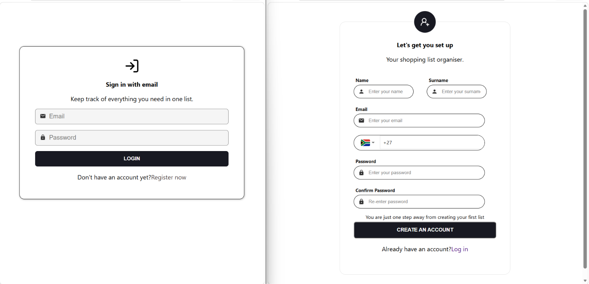
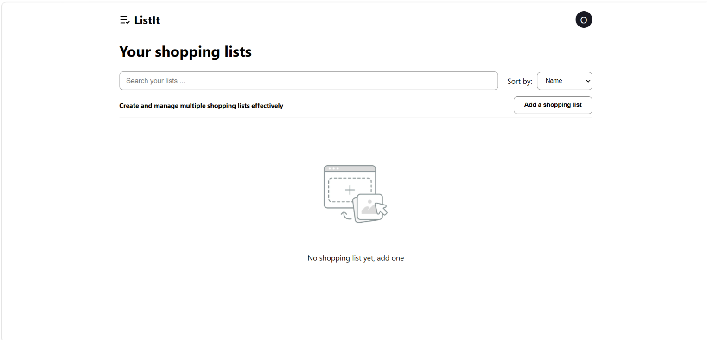
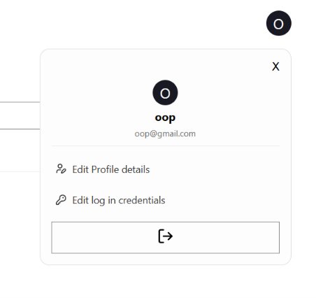

# Shopping List App

A shopping list web app built with eact,Typescipt and Vite.Uses can register their profile ,log in and create their own shopping list .They can add,edit and remove items in each list and also have an option to share the list via link or email

[Live app](https://karabo-shopping-list-app.netlify.app/)

## Features
Users can :
-Register and log in with password hashed for security .
-Ceate their first list and other multiples each with a name and category
-Add items to a list with a name,quantity ,search for item image and optional notes
-Edit or delete any item and manipulate the item quantity using buttons for adding or subtracting
-Search across list and sort by name,categoy or date added.
-Share a list by copying link or choosing email with pre-filled information
-View and edit profile whether it is login details or personal details like name or surname

## How to use

Register or log in
Ceate an account with your name,surname,email ,cellnumber and password  or log in to the existing one.

Create a list 
Click "Add a shopping list " button ,give the list name and categoy and optionally add  your first item .

Manage items
Open a list to add ,edit or delete items 

Search and sort 
Use the search bar for searching and sort to sort by name ,category or date added.

Share a list 
Click the share icon on the list cad to copy the link or send it by email .

Edit your profile
Update your personal details or login credentials from the profile menu or logout.

## Tech Stack
- React + TypeScript
- Vite
- React Router (routing)
- Redux Toolkit (state management)
- json-server (for storing data)
- bcryptjs (password hashing)
-Pixabay API for item images
-Lucide React ,React icons for icons

## Installation

### 1. Clone the repository

git clone https://github.com/Karabo-Merinah/Shopping-list-app.git

## Navigate to the project 

cd Shopping-list-app

### 2. Install dependencies

npm install

### 3. Set up your environment variables

Create a `.env` file in the project root with:

VITE_API_BASE_URL=http://localhost:3000
VITE_SHOPPING_API_KEY=your_pixabay_api_key_here

Get a free Pixabay API key at https://pixabay.com/api/docs/ if you don't already have one.

### 4. Start the backend

npm run server

This runs at `http://localhost:3000`.

## Stat the development server
Start the app (in a separate terminal)

npm run dev

This runs at `http://localhost:5173`.

Both need to be running at the same time as the backend serves login/register/list data, the dev server serves the actual app.

## Build for production

npm run build

## Deployment 
Deployed frontend using Netlify
Deployed backend using Rende

## What I have learnt

-Working with Redux toolkit hooks like useSelector and useDispatch

-Hashing passwords with bcrypt instead of storing them in plain text . 

-Render free tier host spinning down

## App preview

## Routes
- `/` - Login page (logged-out users only)
- `/register` - Register page (logged-out users only)
- `/home` - Home page / your shopping lists (logged-in users only)
- `/profile` - View profile (logged-in users only)
- `/profile/edit` - Edit name/surname/number (logged-in users only)
- `/profile/login` - Edit email/password (logged-in users only)
- `/shared/:listId` - View a shared list (public)

## Branches
- `main` - planning documentation only
- `development` - active development

